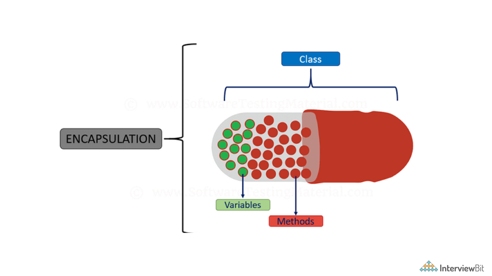
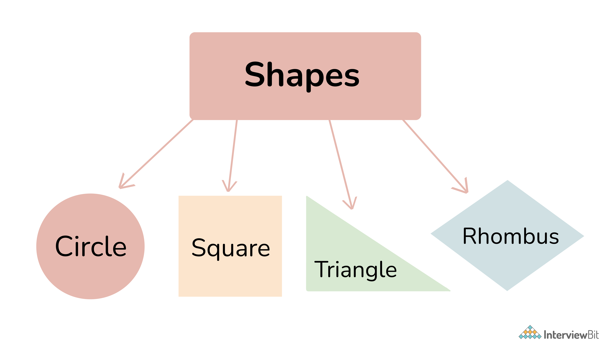
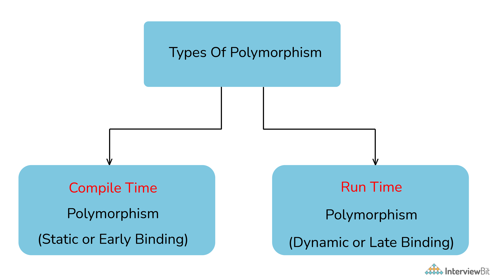
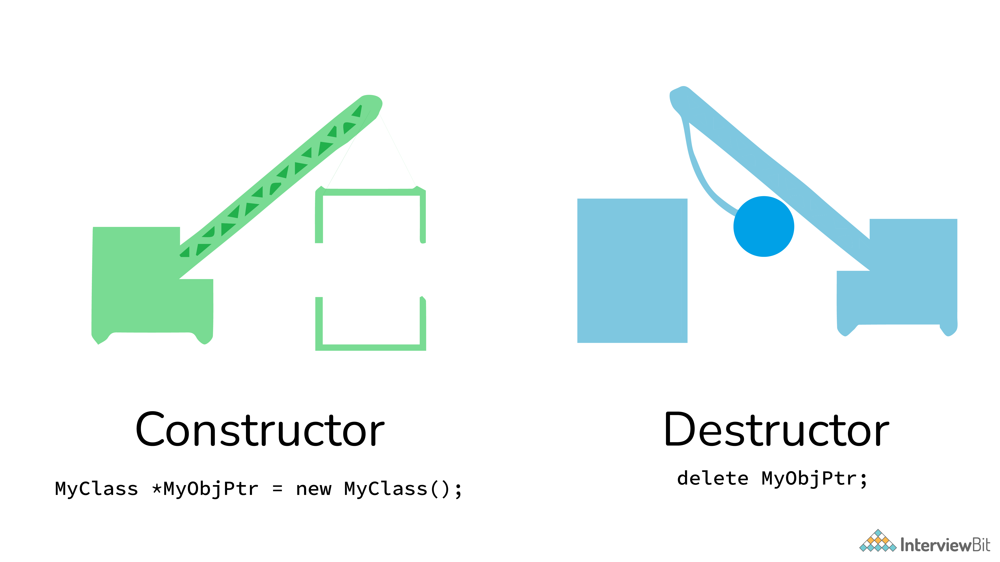
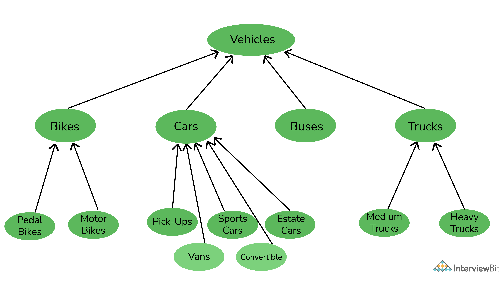
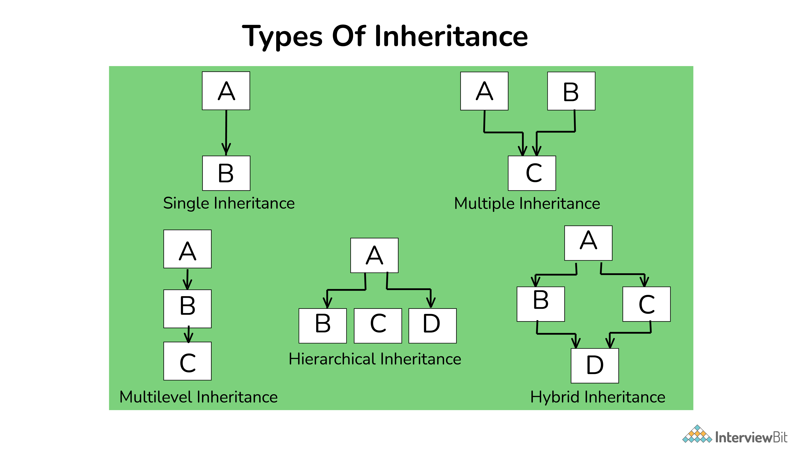
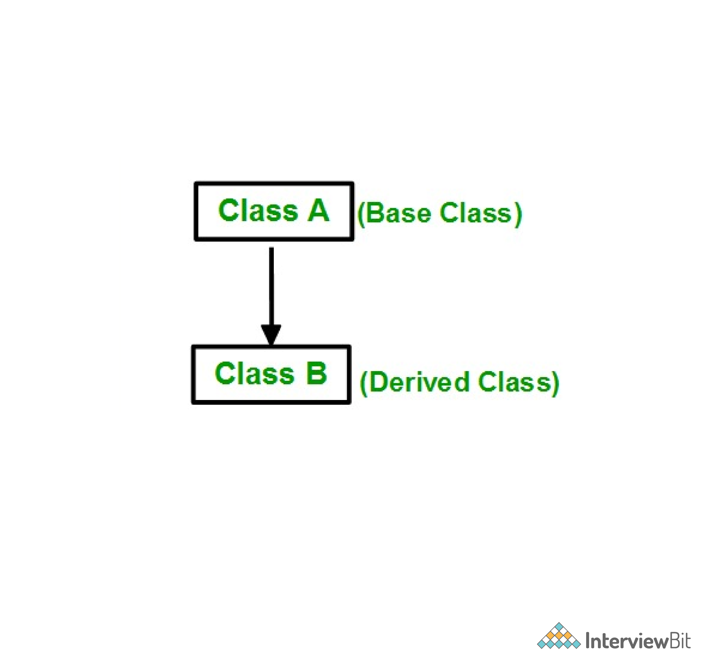

# Lập trình hướng đối tượng


## Lập trình hướng đối tượng là gì 

OOP (Object-Oriented Programming) là một mô hình lập trình để giải quyết vấn đề xoay quanh khái niệm "**Đối tượng**". Đối tượng có thể được xem như là các thể hiện của thực thế ở thế giới thực như là lớp, chúng chứa một số đặc điểm và hành vi được chỉ định trong lớp mẫu.

Ở các ngôn ngữ đơn giản, một lớp có thể là một bản mẫu, dựa trên nó để tạo ra các đối tượng. Thế nên Đối tượng có thể được xem như là một thể hiện của một lớp và thỉnh thoảng nó có thể được gọi là "thực thể". Các thuật ngữ **đặc trưng** ám chỉ đối tượng đó là gì, và **hành vi** chỉ đối tượng đó như thế nào.

Ví dụ, ta tạo mô hình OOP với một chiếc xe:
- Lớp = mẫu xe cụ thể như Audi A4, BMW I8, Maruti Suzuki Vitara Brezza,...
- Đối tượng = Bất kỳ chiếc xe cụ thể nào, như xe của bạn
- Đặc trung = Màu sắc của xe? Số khung xe của bạn là gì?
- Hành vi = Xe chạy như thế nào? Làm thế nào để chuyển số?

Đặc trưng có thể hiểu là dữ liệu, thuộc tính còn hành vi là chức năng, phương thức trong ngôn ngữ lập trình.

Khái niệm “đối tượng” cho phép mô hình OOP dễ dàng truy cập, sử dụng và sửa đổi dữ liệu thực thể và phương thức, tương tác với các đối tượng khác và xác định các phương thức trong thời gian chạy (trong quá trình thực thi chương trình). Điều này mang lại ý nghĩa cho mô hình OOP và làm cho nó trở nên đa dạng trong việc triển khai.

Trên thực tế, mô hình OOP rất phổ biến, đến nỗi nhiều ngôn ngữ lập trình được sử dụng rộng rãi nhất đều hỗ trợ và sử dụng mô hình Lập trình hướng đối tượng hoặc OOPs này, chẳng hạn như Java, C++, Python, C#, v.v.

[1. Thuật ngữ OOP có nghĩa là gì?](#1-thuật-ngữ-oop-có-nghĩa-là-gì)

[2. Tại sao cần OOP?](#2-tại-sao-cần-oop)

[3. Một số ngôn ngữ lập trình hướng đối tượng](#3-một-số-ngôn-ngữ-lập-trình-hướng-đối-tượng)

[4. Một số mô hình lập trình khác ngoài OOP là gì?](#4-một-số-mô-hình-lập-trình-khác-ngoài-oop-là-gì)

[5. Lập trình có cấu trúc nghĩa là gì?](#5-lập-trình-có-cấu-trúc-nghĩa-là-gì)

[6. Các tính năng chính của OOP?](#6-các-tính-năng-chính-của-oop)

[7. Lợi ích của sử dụng OOP?](#7-lợi-ích-của-sử-dụng-oop)

[8. Tại sao OOP lại phổ biến như vậy?](#8-tại-sao-oop-lại-phổ-biến-như-vậy)

[9. Lớp là gì?](#9-lớp-là-gì)

[10. Đối tượng là gì?](#10-đối-tượng-là-gì)

[11. Tính đóng gói là gì?](#11-tính-đóng-gói-là-gì)

[12. Tính đa hình là gì?](#12-tính-đa-hình-là-gì)

[13. Sự khác nhau giữa đa hình thời gian biên dịch và đa hình thời gian chạy?](#13-sự-khác-nhau-giữa-đa-hình-thời-gian-biên-dịch-và-đa-hình-thời-gian-chạy)

[14. C++ hỗ trợ đa hình thế nào?](#14-c-hỗ-trợ-đa-hình-thế-nào)

[15. Kế thừa là gì?](#15-kế-thừa-là-gì)

[16. Trừu tượng là gì?](#16-trừu-tượng-là-gì)

[17. Một lớp chiếm bao nhiêu bộ nhớ?](#17-một-lớp-chiếm-bao-nhiêu-bộ-nhớ)

[18. Có phải lúc nào cũng cần tạo các đối tượng từ lớp không?](#18-có-phải-lúc-nào-cũng-cần-tạo-các-đối-tượng-từ-lớp-không)

[19. Constructor là gì](#19-constructor-là-gì)

[20. Các kiểu constructor trong C++?](#20-các-kiểu-constructor-trong-c)

[21. Copy Constructor là gì?](#21-copy-constructor-là-gì)

[22. Destructor là gì?](#22-destructor-là-gì)

[23. Có phải lớp và cấu trúc giống nhau?](#23-có-phải-lớp-và-cấu-trúc-giống-nhau)

[24. Giải thích về tính kế thừa](#24-giải-thích-về-tính-kế-thừa)

[25. Có bất kỳ hạn chế nào của kế thừa không?](#25-có-bất-kỳ-hạn-chế-nào-của-kế-thừa-không)

[26. Các kiểu kế thừa khác nhau?](#26-các-kiểu-kế-thừa-khác-nhau)

[27. Lớp con là gì?](#27-lớp-con-là-gì)

[28. Lớp cha là gì?](#28-lớp-cha-là-gì)

[29. Interface là gì?](#29-interface-là-gì)

[30. Đa hình tĩnh là gì](#30-đa-hình-tĩnh-là-gì)

[31. Đa hình động là gì](#31-đa-hình-động-là-gì)

[32. Sự khác biệt giữa nạp chồng và ghi đè?](#32-sự-khác-biệt-giữa-nạp-chồng-và-ghi-đè)

[33. Quá trình trừu tượng hóa dữ liệu được thực hiện như thế nào?](#33-quá-trình-trừu-tượng-hóa-dữ-liệu-được-thực-hiện-như-thế-nào)

[34. Lớp trừu tượng là gì?](#34-lớp-trừu-tượng-là-gì)

[35. Một lớp trừu tượng khác với một interface như thế nào?](#35-một-lớp-trừu-tượng-khác-với-một-interface-như-thế-nào)

[36. Các chỉ định truy cập là gì và ý nghĩa của chúng?](#36-các-chỉ-định-truy-cập-là-gì-và-ý-nghĩa-của-chúng)

[37. Ngoại lệ là gì?](#37-ngoại-lệ-là-gì)

[38. Xử lý ngoại lệ như thế nào?](#38-xử-lý-ngoại-lệ-như-thế-nào)

[39. Garbage collection trong OOP là gì?](#39-garbage-collection-trong-oop-là-gì)

[40. Có thể chạy ứng dụng Java mà không triển khai các khái niệm OOP?](#40-có-thể-chạy-ứng-dụng-java-mà-không-triển-khai-các-khái-niệm-oop)

## Câu hỏi phỏng vấn lập trình hướng đối tượng

### 1. Thuật ngữ OOP có nghĩa là gì?
OOP đề cập đến Lập trình hướng đối tượng. Đó là mô hình lập trình được xác định bằng cách sử dụng các đối tượng. Các đối tượng có thể được coi là các thể hiện trong thế giới thực của các thực thể như lớp, có một số đặc điểm và hành vi

### 2. Tại sao cần OOP?

Có nhiều lý do khiến OOP hầu hết được ưa thích, nhưng quan trọng nhất trong số đó là:

- OOP giúp người dùng hiểu phần mềm một cách dễ dàng, mặc dù họ không biết cách triển khai thực tế.
- Với OOP, khả năng đọc, hiểu và khả năng bảo trì của code tăng lên gấp nhiều lần.
- Ngay cả những phần mềm rất lớn cũng có thể được viết và quản lý dễ dàng bằng OOP.

### 3. Một số ngôn ngữ lập trình hướng đối tượng

Các ngôn ngữ lập trình sử dụng và tuân theo mô hình lập trình hướng đối tượng hoặc OOP, được gọi là ngôn ngữ lập trình hướng đối tượng. Một số ngôn ngữ lập trình hướng đối tượng chính bao gồm:

- Java
- C++
- Javascript
- Python
- PHP

### 4. Một số mô hình lập trình khác ngoài OOP là gì?

Mô hình lập trình đề cập đến phương pháp phân loại ngôn ngữ lập trình dựa trên các tính năng của chúng. Chủ yếu có hai loại Mô hình lập trình:

- Mô hình lập trình mệnh lệnh
- Mô hình lập trình khai báo

Bây giờ, các mô hình này có thể được phân loại thêm dựa trên:

1. **Mô hình lập trình mệnh lệnh**: Lập trình mệnh lệnh tập trung vào CÁCH thực thi logic chương trình và định nghĩa luồng điều khiển là các câu lệnh thay đổi trạng thái chương trình. Điều này có thể được phân loại thêm là:

    a) *Mô hình lập trình hướng thủ tục*: Lập trình theo thủ tục xác định các bước mà một chương trình phải thực hiện để đạt được trạng thái mong muốn, thường được đọc theo thứ tự từ trên xuống dưới.
    
    b) *Lập trình hướng đối tượng hoặc OOP*: Lập trình hướng đối tượng (OOP) tổ chức các chương trình dưới dạng các đối tượng, chứa một số thuộc tính và có một số hành vi.
    
    c) *Lập trình song song*: Mô hình lập trình song song chia một nhiệm vụ thành các nhiệm vụ con và tập trung vào việc thực hiện chúng đồng thời cùng một lúc.

2. **Mô hình lập trình khai báo**: Lập trình khai báo tập trung vào CÁI GÌ để thực thi và định nghĩa logic chương trình, nhưng không phải là một luồng điều khiển chi tiết. Mô hình khai báo có thể được phân loại thêm thành:

    a) *Mô hình lập trình logic*: Mô hình lập trình logic dựa trên logic hình thức, đề cập đến một tập hợp các câu diễn đạt các dữ kiện và quy tắc về cách giải quyết một vấn đề

    b) *Mô hình lập trình chức năng*: Mô hình lập trình chức năng là mô hình lập trình trong đó các chương trình được xây dựng bằng cách áp dụng và soạn thảo các hàm.
    
    c) *Mô hình lập trình cơ sở dữ liệu*: Mô hình lập trình cơ sở dữ liệu được sử dụng để quản lý dữ liệu và thông tin có cấu trúc như trường, bản ghi và file.


### 5. Lập trình có cấu trúc nghĩa là gì?

Lập trình có cấu trúc đề cập đến phương pháp lập trình bao gồm một luồng điều khiển hoàn toàn có cấu trúc. Ở đây cấu trúc đề cập đến một khối, chứa một tập hợp các quy tắc và có một luồng điều khiển cuối cùng, chẳng hạn như (if/then/else), (while và for), cấu trúc khối và chương trình con.

Gần như tất cả các mô hình lập trình đều bao gồm Lập trình có cấu trúc, bao gồm cả mô hình OOP.

### 6. Các tính năng chính của OOP?

OOP hoặc Lập trình hướng đối tượng chủ yếu bao gồm bốn tính năng dưới đây và đảm bảo rằng bạn không bỏ lỡ bất kỳ tính năng nào sau đây:

- Tính kế thừa
- Tính đóng gói
- Tính đa hình
- Tính trừu tượng


### 7. Lợi ích của sử dụng OOP?

- OOP rất hữu ích trong việc giải quyết các vấn đề ở mức độ rất phức tạp.
- Các chương trình có độ phức tạp cao có thể được tạo, xử lý và bảo trì dễ dàng bằng cách sử dụng lập trình hướng đối tượng.
- OOP, thúc đẩy việc tái sử dụng code, do đó giảm bớt sự dư thừa.
- OOP cũng giúp ẩn những chi tiết không cần thiết với sự trợ giúp của tính trừu tượng .
- OOP, dựa trên cách tiếp cận từ dưới lên, không giống như mô hình lập trình cấu trúc, sử dụng cách tiếp cận từ trên xuống.
- Tính đa hình cung cấp rất nhiều tính linh hoạt trong các OOP.

### 8. Tại sao OOP lại phổ biến như vậy?

Mô hình lập trình OOP được coi là một phong cách lập trình tốt hơn. Nó không chỉ giúp dễ dàng viết một đoạn code phức tạp mà còn cho phép người dùng xử lý và duy trì chúng một cách dễ dàng. Không chỉ vậy, các tính năng chính của OOP - Trừu tượng hóa, Đóng gói, Kế thừa và Đa hình, giúp lập trình viên dễ dàng giải quyết các tình huống phức tạp. Do đó, OOP rất phổ biến.

### 9. Lớp là gì?

Một lớp có thể được hiểu là một khuôn mẫu hoặc một bản thiết kế, chứa một số giá trị, được gọi là thuộc tính và một số bộ quy tắc, được gọi là hành vi hoặc chức năng. Vì vậy, khi một đối tượng được tạo, nó sẽ tự động lấy thuộc tính và phương thức đã được định nghĩa trong lớp.

Do đó, về cơ bản lớp là một khuôn mẫu hoặc bản thiết kế cho các đối tượng. Ngoài ra, người ta có thể tạo bao nhiêu đối tượng tùy thích dựa trên một lớp.

Ví dụ: đầu tiên, mẫu của một chiếc ô tô được tạo. Sau đó, nhiều chiếc xe được tạo ra dựa trên mẫu đó.

### 10. Đối tượng là gì?

Một đối tượng đề cập đến thực thể của lớp, bao gồm toàn bộ các thuộc tính và phương thức được xác định trong lớp mẫu. Trong thực tế, một đối tượng là một thực thể thực tương tác với người dùng trong khi lớp là bản thiết kế cho đối tượng đó. Vì vậy, các đối tượng tiêu thụ không gian và có một số hành vi đặc trưng.

### 11. Tính đóng gói là gì?



Người ta có thể hình dung đóng gói là phương pháp đưa mọi thứ cần thiết để thực hiện công việc vào bên trong một viên thuốc và trình bày viên thuốc đó cho người dùng. Điều đó có nghĩa là bằng đóng gói, tất cả các dữ liệu và phương thức cần thiết được liên kết với nhau và tất cả các chi tiết không cần thiết được ẩn đối với người dùng bình thường. Vì vậy, đóng gói là quá trình liên kết các thuộc tính và các phương thức của một chương trình với nhau để thực hiện một công việc cụ thể, mà không để lộ các chi tiết không cần thiết.

Đóng gói có thể được xác định theo hai cách:

1. **Data hiding**: đóng gói là quá trình ẩn thông tin không mong muốn, hạn chế các truy cập đến thuộc tính của đối tượng.
2. **Data binding**: là quá trình liên kết các thuộc tính và các phương thức với nhau như một tổng thể. 

### 12. Tính đa hình là gì?

Đa hình đề cập đến một thứ có thể có nhiều hình dạng.
Overide - Overload: là 1 dạng đa hình: 1 tác vụ(hàm, phương thức) có nhiều cách thể hiện khác nhau



Trong OOP, Đa hình đề cập đến quá trình mà một số code, dữ liệu, phương thức hoặc đối tượng hoạt động khác nhau trong các trường hợp hoặc ngữ cảnh khác nhau. Đa hình thời gian biên dịch và đa hình thời gian chạy là hai loại đa hình trong các ngôn ngữ OOP.

### 13. Sự khác nhau giữa đa hình thời gian biên dịch và đa hình thời gian chạy?



**Compile Time Polymorphism**: còn gọi là đa hình tĩnh, đề cập đến kiểu đa hình xảy khi khi biên dịch. Có nghĩa là trình biên dịch quyết định hình dạng hoặc giá trị nào được thực thể sử dụng.

```java
// In this program, we will see how multiple functions are created with the same name, 
// but the compiler decides which function to call easily at the compile time itself.
class CompileTimePolymorphism{
    // 1st method with name add
    public int add(int x, int y){ 
        return x+y;
    }
    // 2nd method with name add
    public int add(int x, int y, int z){
        return x+y+z;
    }
    // 3rd method with name add
    public int add(double x, int y){ 
        return (int)x+y;
    }
    // 4th method with name add
    public int add(int x, double y){ 
        return x+(int)y;
    }
}
class Test{
    public static void main(String[] args){
        CompileTimePolymorphism demo=new CompileTimePolymorphism();
        // In the below statement, the Compiler looks at the argument types and decides to call method 1
        System.out.println(demo.add(2,3));
        // Similarly, in the below statement, the compiler calls method 2
        System.out.println(demo.add(2,3,4));
        // Similarly, in the below statement, the compiler calls method 4
        System.out.println(demo.add(2,3.4));
        // Similarly, in the below statement, the compiler calls method 3
        System.out.println(demo.add(2.5,3)); 
    }
}
```

Trong ví dụ trên, có bốn phiên bản của các phương thức `add()`. Phương thức đầu tiên nhận hai tham số trong khi phương thức thứ hai nhận ba tham số. Đối với phương pháp thứ ba và thứ tư, có sự thay đổi thứ tự của các tham số. Trình biên dịch xem xét dấu hiệu của phương thức và quyết định phương thức nào sẽ gọi cho một lệnh gọi cụ thể tại thời điểm biên dịch.

**Runtime Polymorphism**: còn gọi là đa hình động, đề cập đến kiểu đa hình xảy khi khi đang chạy. Điều đó có nghĩa là nó không thể được quyết định bởi trình biên dịch. Do đó, hình dạng hoặc giá trị nào phải được thực hiện tùy thuộc vào quá trình thực thi.

```java
class AnyVehicle{
    public void move(){
        System.out.println(“Any vehicle should move!!”);
    }
}
class Bike extends AnyVehicle{
    public void move(){
        System.out.println(“Bike can move too!!”);
    }
}
class Test{
    public static void main(String[] args){
        AnyVehicle vehicle = new Bike();
        // In the above statement, as you can see, the object vehicle is of type AnyVehicle
        // But the output of the below statement will be “Bike can move too!!”, 
        // because the actual implementation of object ‘vehicle’ is decided during runtime vehicle.move();
        vehicle = new AnyVehicle();
        // Now, the output of the below statement will be “Any vehicle should move!!”, 
        vehicle.move();
    }
}
```

### 14. C++ hỗ trợ đa hình thế nào?

C++ là ngôn ngữ lập trình hướng đối tượng và hỗ trợ đa hình rất tốt:

- Compile Time Polymorphism: C ++ hỗ trợ tính đa hình thời gian biên dịch với sự trợ giúp của các tính năng như mẫu, nạp chồng hàm và các tham số mặc định.

- Runtime Polymorphism: C ++ hỗ trợ tính đa hình Runtime với sự trợ giúp của các tính năng như hàm ảo. Các hàm ảo có hình dạng của các hàm dựa trên loại đối tượng trong tham chiếu và được giải quyết trong thời gian chạy.

### 15. Kế thừa là gì?

Thuật ngữ "kế thừa" có nghĩa là "nhận được một số phẩm chất hoặc hành vi từ cha mẹ cho con cái." Trong lập trình hướng đối tượng, kế thừa là cơ chế mà một đối tượng hoặc lớp (được gọi là con) được tạo ra bằng cách sử dụng định nghĩa của một đối tượng hoặc lớp khác (được gọi là cha). Kế thừa không chỉ giúp giữ cho việc triển khai đơn giản hơn mà còn giúp tạo điều kiện sử dụng lại code.

### 16. Trừu tượng là gì?

Nếu bạn là người dùng và bạn có một vấn đề, bạn không muốn biết các thành phần của phần mềm hoạt động như thế nào hoặc nó được tạo ra như thế nào. Bạn chỉ muốn biết cách phần mềm giải quyết vấn đề của bạn. Trừu tượng hóa là phương pháp che giấu những chi tiết không cần thiết khỏi những cái cần thiết. Đây là một trong những tính năng chính của OOP.

Ví dụ như một chiếc xe. Bạn chỉ cần biết cách chạy chiếc xe đó, còn nó gồm những bộ phận, động cơ có mấy xi lanh thì không cần quan tâm. Điều này được gọi là trừu tượng.

### 17. Một lớp chiếm bao nhiêu bộ nhớ?

Lớp không chứa bất kỳ bộ nhớ nào. Nó là một bản thiết kế để cái đối tượng dựa vào nó mà tạo. Chỉ khi đối tượng được tạo, nó mới thực sự tạo các thuộc tính và phương thức và mới tốn bộ nhớ.

### 18. Có phải lúc nào cũng cần tạo các đối tượng từ lớp không?

Không. Một đối tượng chỉ được tạo nếu lớp cơ sở có các phương thức động. Nhưng nếu lớp có các phương thức tĩnh, thì các đối tượng không cần phải được tạo. Bạn có thể gọi phương thức lớp trực tiếp trong trường hợp này, bằng cách sử dụng tên lớp.

### 19. Constructor là gì?

Cóntructor hay hàm khởi tạo là một phương thức đặc biệt có tên giống như tên lớp. Hàm khởi tạo dùng cho mục đích đặc biệt là khởi tạo đối tượng. Ví dụ: ta có lớp tên là `MyClass`, khi bạn khởi tạo lớp này, bạn truyền cú pháp:

```java
MyClass myClassObject = new MyClass();
```

Ở đây, phương thức được gọi sau từ khoá `new` là `MyClass()` là hàm khởi tạo của lớp này.  Điều này giúp khởi tạo thuộc tính và các phương thức để gán chúng cho đối tượng `myClassObject`. 



### 20. Các kiểu constructor trong C++?

Các constructor có các phân loại phổ biến như sau:

- **Default Constructor**: Hàm khởi tạo mặc định không nhận bất kỳ tham số nào.

```cpp
class ABC
{
    int x;
        
    ABC()
    {
        x = 0;
    }
}
```

- **Parameterized constructor**: hàm khởi tạo này nhận về một hay nhiều tham số.

```cpp
class ABC
{
    int x;
        
    ABC(int y)
    {
        x = y;
    }
}
```

- **Copy constructor**: là một hàm thành viên khởi tạo một đối tượng bằng cách sử dụng một đối tượng khác của cùng một lớp.

```cpp
class ABC
{
    int x;
        
    ABC(int y)
    {
        x = y;
    }
    // Copy constructor
    ABC(ABC abc)
    {
        x = abc.x;
    }
}
```

### 21. Copy Constructor là gì?

Copy Constructor hay hàm khởi tạo sao chép, có mục đích là sao chép một đối tượng sang một đối tượng khác. Điều đó có nghĩa là một phương thức khởi tạo sao chép sẽ sao chép một đối tượng và các giá trị của nó, vào một đối tượng khác, với điều kiện là cả hai đối tượng đều thuộc cùng một lớp.

### 22. Destructor là gì?

Trái ngược với các hàm khởi tạo, khởi tạo các đối tượng và chỉ định không gian cho chúng, các Hàm hủy cũng là các phương thức đặc biệt. Nhưng hàm hủy giải phóng tài nguyên và bộ nhớ được sử dụng bởi một đối tượng. Bộ hủy được tự động gọi khi một đối tượng đang bị hủy.

### 23. Có phải lớp và cấu trúc giống nhau?

Không, lớp và cấu trúc không giống nhau. Mặc dù chúng có vẻ giống nhau, nhưng chúng có những điểm khác biệt khiến chúng trở nên khác biệt. Ví dụ, cấu trúc được lưu trong bộ nhớ stack, trong khi lớp được lưu trong bộ nhớ heap. Ngoài ra, tính trừu tượng hóa dữ liệu không thể có trong cấu trúc, nhưng với lớp, tính trừu tượng được sử dụng chủ yếu.

### 24. Giải thích về tính kế thừa?

Kế thừa là một trong những đặc điểm chính của lập trình hướng đối tượng, theo đó một thực thể kế thừa một số đặc điểm và hành vi của một thực thể khác và biến chúng thành của riêng mình. Kế thừa giúp cải thiện và tạo điều kiện sử dụng lại code.

Ta sẽ giải thích bằng một ví dụ dễ hiểu. Ta có ba phương tiện khác nhau - xe hơi, xe tải hoặc xe buýt. Ba loại này hoàn toàn khác nhau với những đặc điểm và hành vi cụ thể của riêng chúng. Nhưng ở cả ba, bạn sẽ tìm thấy một số yếu tố chung, như vô lăng, chân ga, ly hợp, phanh, v.v. Mặc dù những yếu tố này được sử dụng trên các loại xe khác nhau, chúng vẫn có những đặc điểm chung của tất cả các loại xe. Điều này đạt được nhờ vào sự kế thừa. Xe hơi, xe tải và xe buýt đều được thừa hưởng các tính năng như vô lăng, chân ga, ly hợp, phanh, v.v. và sử dụng chúng như của riêng mình. Do đó, chúng không phải tạo các thành phần này từ đầu, nhờ thế tạo điều kiện sử dụng lại code.



### 25. Có bất kỳ hạn chế nào của kế thừa không?

Vâng, với nhiều quyền lực hơn đi kèm với nhiều phức tạp hơn. Kế thừa là một tính năng rất mạnh trong OOP, nhưng nó cũng có một số hạn chế. Kế thừa cần thêm thời gian để xử lý, vì nó cần điều hướng qua nhiều lớp để triển khai. Ngoài ra, các lớp liên quan đến Kế thừa - lớp cơ sở và lớp con, được kết hợp rất chặt chẽ với nhau. Vì vậy, nếu một người cần thực hiện một số thay đổi, họ có thể cần thực hiện các thay đổi lồng nhau trong cả hai lớp. Kế thừa cũng có thể phức tạp để thực hiện. Vì nếu không được triển khai chính xác, có thể dẫn đến lỗi không mong muốn hoặc kết quả đầu ra không chính xác.

### 26. Các kiểu kế thừa khác nhau?

- Đơn kế thừa (Single inheritance)
- Đa kế thừa (Multiple inheritance)
- Kế thừa đa cấp (Multi-level inheritance)
- Kế thừa phân cấp (Hierarchical inheritance)
- Siêu kế thừa (Hybrid inheritance)



### 27. Lớp con là gì?

Lớp con là một phần của Kế thừa. Lớp con là một thực thể, được kế thừa từ một lớp khác.

### 28. Lớp cha là gì?

Lớp cha  là một phần của Kế thừa. Lớp cha là một thực thể, cho phép các lớp con kế thừa từ chính nó. 



### 29. Interface là gì?

Interface đề cập đến một loại lớp đặc biệt, chứa các phương thức, nhưng không phải là định nghĩa của chúng. Chỉ cho phép khai báo các phương thức bên trong một interface. Bạn không thể tạo các đối tượng bằng cách dùng interface. Thay vào đó, bạn cần triển khai interface đó và xác định các phương pháp để triển khai chúng. 

### 30. Đa hình tĩnh là gì?

Còn gọi là đa hình thời gian biên dịch. Đa hình tĩnh là tính năng mà một đối tượng được liên kết với hàm hoặc toán tử tương ứng dựa trên các giá trị trong thời gian biên dịch. Đa hình thời gian tĩnh hoặc thời gian biên dịch có thể đạt được thông qua nạp chồng phương thức hoặc nạp chồng toán tử. 

### 31. Đa hình động là gì?

Còn gọi là đa hình thời gian chạy, theo đó việc triển khai thực sự của hàm được quyết định trong thời gian chạy hoặc thực thi. Tính đa hình động hoặc thời gian chạy có thể đạt được với sự trợ giúp của ghi đè phương thức.

### 32. Sự khác biệt giữa nạp chồng và ghi đè?

Nạp chồng là một tính năng đa hình thời gian biên dịch, trong đó một thực thể có nhiều triển khai có cùng tên. Ví dụ, nạp chồng phương thức và nạp chồng toán tử.

Trong khi ghi đè là một tính năng đa hình thời gian chạy trong đó một thực thể có cùng tên, nhưng việc triển khai của nó thay đổi trong quá trình thực thi. Ví dụ, ghi đè phương thức.

### 33. Quá trình trừu tượng hóa dữ liệu được thực hiện như thế nào?

Sự trừu tượng hóa dữ liệu được thực hiện với sự trợ giúp của các phương thức trừu tượng hoặc các lớp trừu tượng.

### 34. Lớp trừu tượng là gì?

Một lớp trừu tượng là một lớp đặc biệt chứa các phương thức trừu tượng. Đặc trưng của lớp trừu tượng là các phương thức trừu tượng bên trong nó không được thực thi mà chỉ được khai báo. Do đó, khi một lớp con kế thừa lớp trừu tượng và cần sử dụng các phương thức trừu tượng của nó, chúng cần phải định nghĩa và triển khai chúng.

### 35. Một lớp trừu tượng khác với một interface như thế nào?

Interface và lớp trừu tượng đều là những kiểu lớp đặc biệt chỉ chứa phần khai báo các phương thức chứ không chứa phần thực thi của chúng. Nhưng interface hoàn toàn khác với một lớp trừu tượng. Sự khác biệt chính của cả hai là, khi một interface được triển khai, lớp con phải xác định tất cả các phương thức của nó và cung cấp cách triển khai của nó. Trong khi đó khi một lớp trừu tượng được kế thừa, lớp con không cần cung cấp định nghĩa về phương thức trừu tượng của nó, cho đến khi lớp con sử dụng nó.

Ngoài ra, một lớp trừu tượng có thể chứa các phương thức trừu tượng cũng như các phương thức không trừu tượng.

### 36. Các chỉ định truy cập là gì và ý nghĩa của chúng?

Các chỉ định truy cập là một loại từ khóa đặc biệt, được sử dụng để kiểm soát hoặc chỉ định khả năng truy cập của các thực thể như lớp, phương thức, v.v. Một số từ chỉ định truy cập hoặc công cụ sửa đổi truy cập bao gồm "private", "public", v.v… Các chỉ định truy cập này cũng đóng một vai trò rất quan trọng trong việc đạt được tính đóng gói - một trong những tính năng chính của OOP.

### 37. Ngoại lệ là gì?

Một ngoại lệ có thể được coi là một sự kiện đặc biệt, xuất hiện trong quá trình thực hiện một chương trình trong thời gian chạy, khiến việc thực thi bị tạm dừng. Lý do cho ngoại lệ chủ yếu là do một vị trí trong chương trình, nơi người dùng muốn làm điều gì đó mà chương trình không được chỉ định, chẳng hạn như đầu vào không mong muốn.

### 38. Xử lý ngoại lệ như thế nào?

Không ai muốn phần mềm của mình bị lỗi hoặc gặp sự cố. Các trường hợp ngoại lệ là lý do chính dẫn đến lỗi phần mềm. Các ngoại lệ có thể được xử lý trước trong chương trình và ngăn việc thực thi dừng lại. Đây được gọi là xử lý ngoại lệ.

Vì vậy, xử lý ngoại lệ là cơ chế xác định các trạng thái không mong muốn mà chương trình có thể có và xác định các kết quả mong muốn của các trạng thái đó.

**Try-catch** là phương pháp phổ biến nhất được sử dụng để xử lý các ngoại lệ trong chương trình

### 39. Garbage collection trong OOP là gì?

Lập trình hướng đối tượng xoay quanh các thực thể như các đối tượng. Mỗi đối tượng sử dụng bộ nhớ và có thể có nhiều đối tượng của một lớp. Vì vậy, nếu các đối tượng này và dữ liệu của chúng không được xử lý đúng cách, thì nó có thể dẫn đến một số lỗi liên quan đến bộ nhớ và hệ thống có thể bị lỗi.

Bộ dọn gác - garbage collection - đề cập đến cơ chế xử lý bộ nhớ trong chương trình. Thông qua việc thu gom rác, bộ nhớ không mong muốn sẽ được giải phóng bằng cách loại bỏ các đối tượng không còn cần thiết.

### 40. Có thể chạy ứng dụng Java mà không triển khai các khái niệm OOP?

Không. Các ứng dụng Java dựa trên các mô hình lập trình hướng đối tượng hoặc khái niệm OOP, do đó chúng không thể được triển khai nếu không có nó.

Tuy nhiên, mặt khác, C ++ có thể được thực hiện mà không cần OOP, vì nó cũng hỗ trợ mô hình lập trình cấu trúc giống C.
